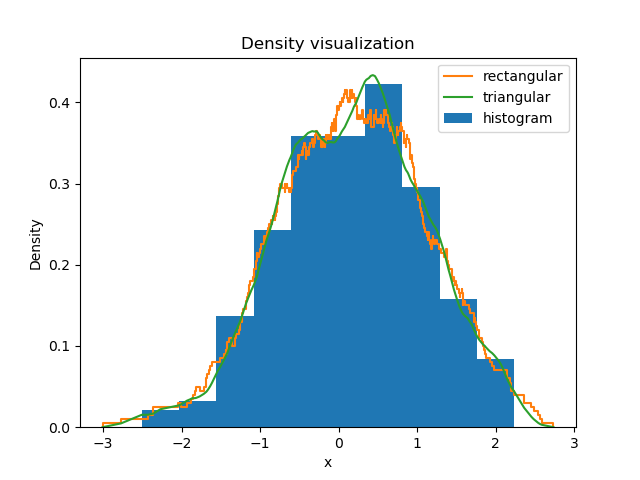

# histogram_alternative
Alternatives to histogram for density plotting

## Usage

See `example_usage.py` for the code used to generate this image.

## Remarks

The time complexity is `O(n log n)` for n samples, with no dependence on the scaling of the kernel. It's rectangular and triangular kernels in particular that make this possible.
